# 무니에게 알려줘 (Moni)

<p align="center">
  
</p>

<p align="center">
  <strong>"학생이 AI를 가르치며 배운다"</strong> — 프로테제 효과(Protege Effect) 기반 AI 학습 앱
</p>

🔗 **데모**: [https://moni.haeseung.site/demo](https://moni.haeseung.site/demo)

🤖 **파인튜닝 모델**: [https://github.com/GOOHAESEUNG/moni_ai](https://github.com/GOOHAESEUNG/moni_ai)

---

학생이 오늘 배운 개념을 AI 캐릭터 **무니**(달에서 온 아기 토끼)에게 설명합니다.
무니는 의도적으로 모르는 척하고 꼬리 질문을 던져, 학생이 **진짜 모르는 지점**을 스스로 발견하게 합니다.
선생님은 자동 생성된 이해도 리포트로 학생을 관리합니다.

## 스크린샷

### 랜딩 페이지
> Berkshire Swash 타이포그래피 히어로 + 학습자/교육자 양면 소개
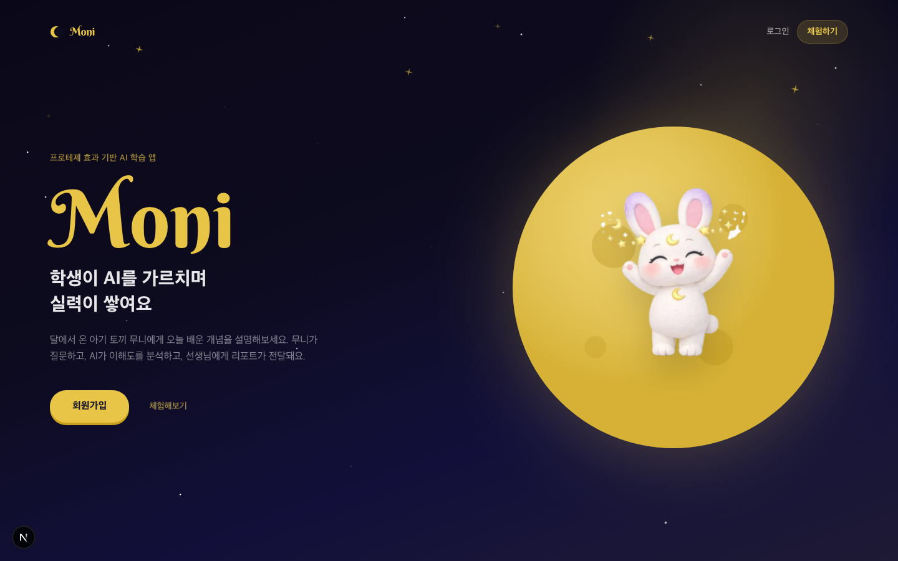

### 학생 홈 — 학습 퀘스트맵
> 완료/진행/잠금 3종 노드로 학습 진도를 시각화. 무니가 말풍선으로 격려합니다.
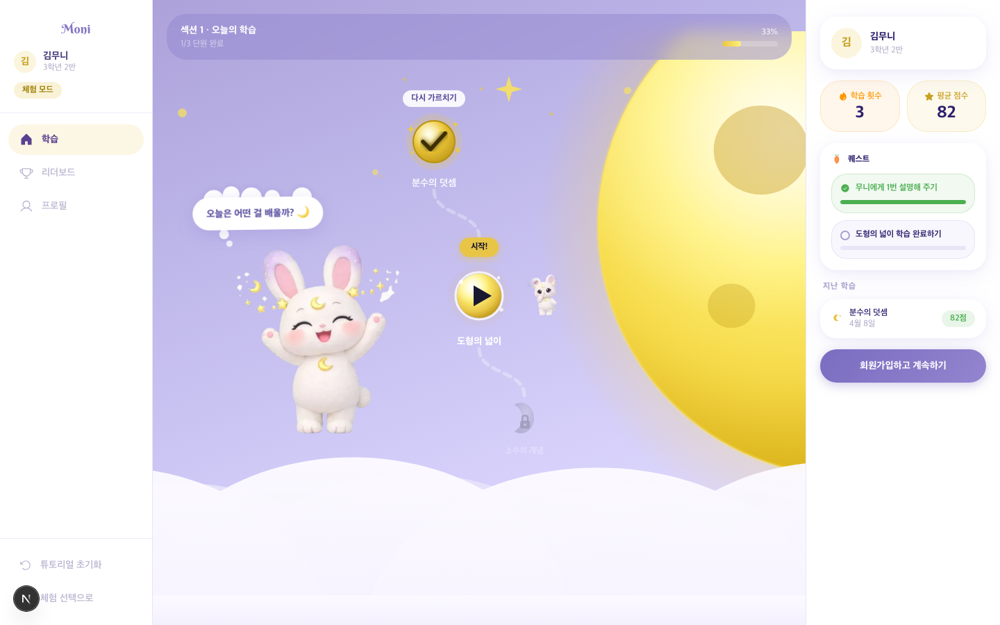

### 무니와 대화 — 프로테제 효과의 핵심
> 학생이 개념을 설명하면 무니가 꼬리 질문으로 진짜 이해를 확인. 그림판으로 시각 설명도 가능합니다.
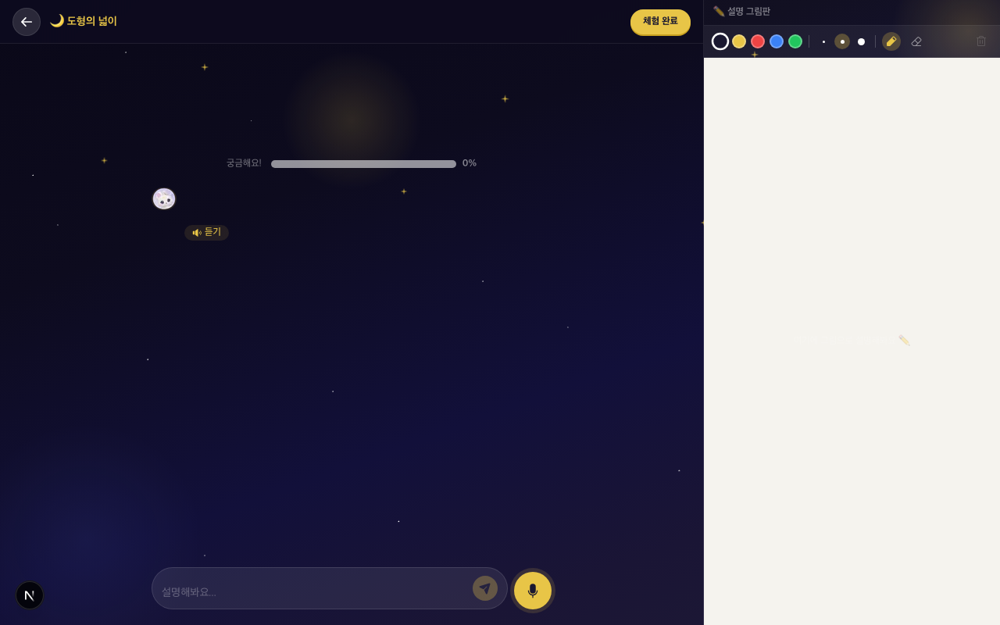

### 학습 리포트 — AI 자동 생성
> GPT-4o가 이해도 점수(0-100) + 취약점 + 학습 제안을 생성. Gemma 4B LoRA로 4대 핵심역량까지 분석합니다.
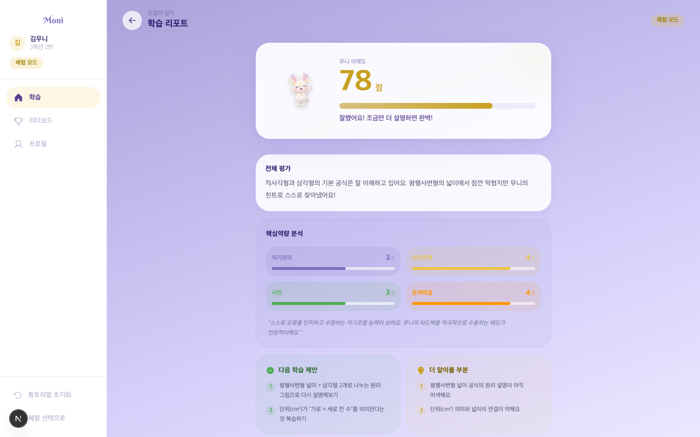

### 리더보드 — 게이미피케이션
> 반 친구들과 이해도 점수 경쟁. 연속 학습일 표시로 학습 습관을 유도합니다.
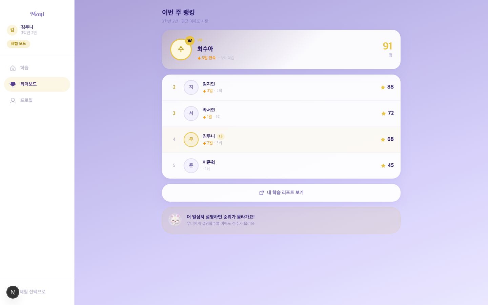

### 선생님 대시보드 — 단원 관리
> NCIC 2022 교육과정 기반 단원 배정. 학생 완료율 진행바와 최근 리포트를 한눈에 확인합니다.
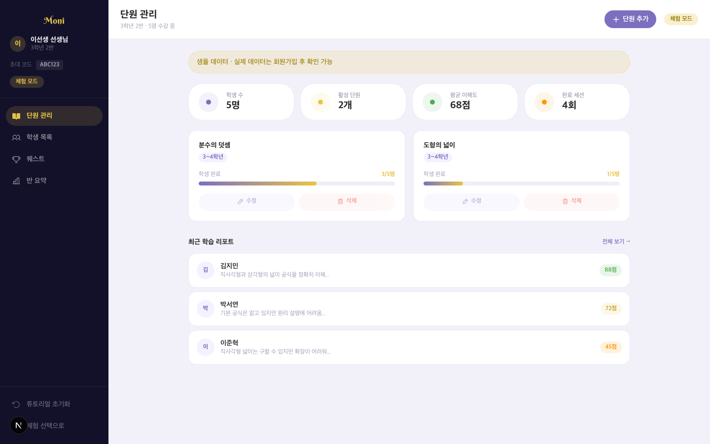

### 학생 상세 — 개별 역량 추적
> 학생별 세션 히스토리, 이해도 추이, 4대 핵심역량 점수. 학부모 상담 자료도 버튼 하나로 생성합니다.
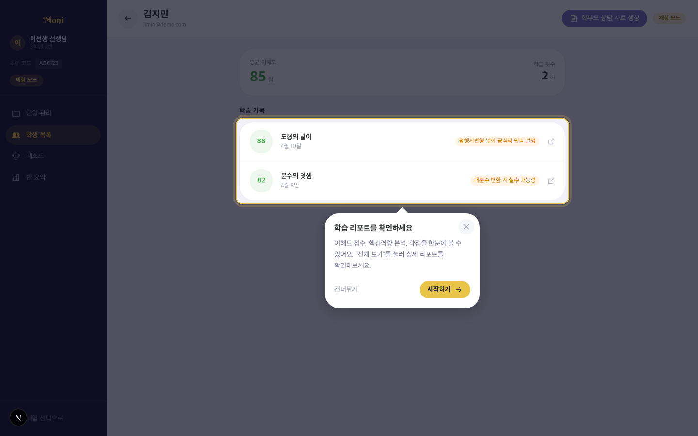

### 반 전체 요약 — AI 수업 추천
> 평균 이해도, 참여율, 약점 TOP, 학생별 히트맵을 집계. GPT-4o가 맞춤 수업 전략을 추천합니다.
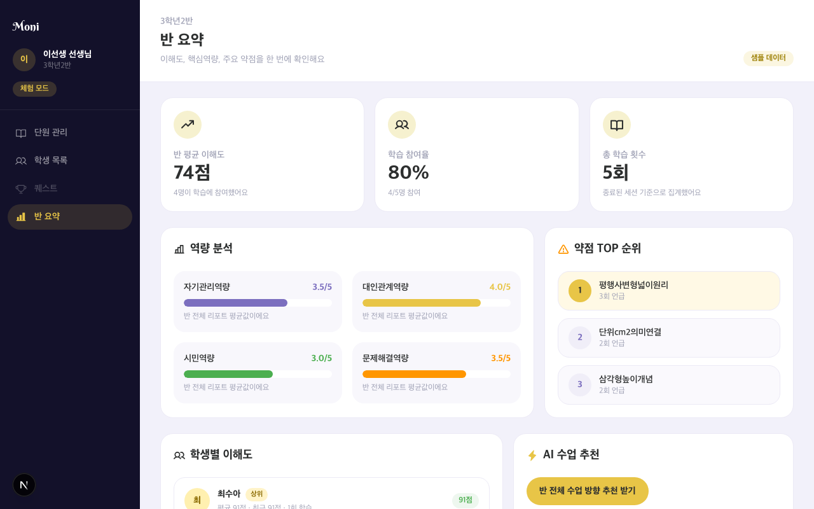

### 퀘스트 관리
> 학생에게 학습 목표를 퀘스트로 부여하고 관리합니다. 반 전체 또는 개별 학생 대상 설정 가능.
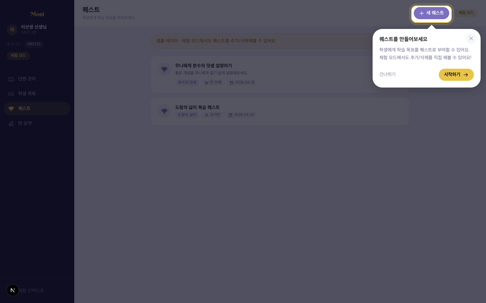

## 왜 만들었나

초등학교 교사 2인 + 소규모 학원 강사 2인, 총 4인의 심층 인터뷰에서 발견한 페인포인트:

| 인터뷰 대상 | 핵심 페인포인트 |
|------------|---------------|
| 초등 교사 A | "30명 학생의 이해도를 수업 중에 파악하기 불가능. 시험 치고 나서야 알게 된다" |
| 초등 교사 B | "학부모 상담 때 객관적 근거가 없어서 '느낌'으로 말하게 된다" |
| 학원 강사 A | "피드백 1인당 10분, 20명이면 하루 3시간+. 수기 메모장으로 관리" |
| 학원 강사 B | "AI 도입하고 싶은데 세팅이 복잡하고 월 비용이 부담" |

**공통 문제**: 학생이 "아는 척"하는지 판별 불가 → 공식 암기 vs 원리 이해 구분이 안 됨

## 핵심 기능

### 학생
- **무니에게 설명하기** — 오늘 배운 개념을 대화로 설명 (음성/텍스트/그림)
- **실시간 이해도 추적** — 대화 중 이해도 0-100 자동 평가
- **학습 리포트** — 세션 종료 시 이해도 점수, 취약점, 학습 제안 자동 생성
- **4대 핵심역량 분석** — 자체 파인튜닝 모델이 자기관리/대인관계/시민/문제해결 역량 평가

### 선생님
- **반 관리** — 초대 코드로 학생 등록, NCIC 2022 교육과정 기반 단원 배정 (`curriculum.json`)
- **학생별 상세** — 세션 히스토리, 이해도 추이, 역량 점수
- **반 전체 요약 대시보드** — 평균 이해도, 역량 분석, 약점 TOP, 학생 히트맵
- **AI 수업 추천** — 반 데이터 기반 맞춤 수업 전략 제안
- **학부모 상담 자료** — 버튼 하나로 강점/개선점/가정 실천 방안 1페이지 요약

### 데모 체험
- 회원가입 없이 학생/선생님 체험 가능
- 튜토리얼 오버레이 + 대본 카드로 가이드
  
## AI 아키텍처

### 서비스 내 AI

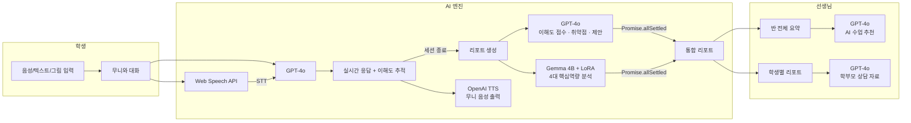

### 개발 에이전트 파이프라인 (GAN 영감)

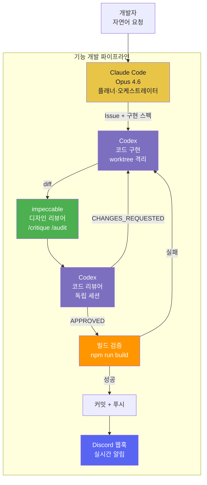

### 자율 개선 루프 (Autonomous Improvement Loop)

마감 전날 밤, 개발자가 수면 중에도 Claude Code가 스스로 프로젝트 품질을 반복 개선하는 시스템. 7시간 동안 11라운드, 17개 커밋 자동 생성.

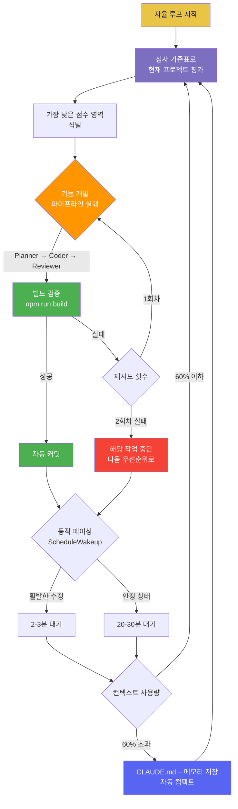

**왜 멀티 AI인가?** — GAN의 생성기-판별기 구조에서 영감. 코더가 생성하고, 리뷰어가 판별하여 품질이 수렴합니다. 단일 에이전트의 자기평가 편향을 구조로 해결합니다. 마감 전날 밤에는 자율 개선 루프가 11라운드 동안 스스로 프로젝트를 개선했습니다.

## 기술 스택

| 영역 | 기술 |
|------|------|
| 프레임워크 | Next.js 16 (App Router) · TypeScript |
| 스타일링 | Tailwind CSS v4 · Framer Motion |
| 데이터베이스 | Supabase (PostgreSQL + Auth + RLS) |
| AI (서비스) | OpenAI GPT-4o · Gemma 4B LoRA · Web Speech API |
| AI (개발) | Claude Code (Opus 4.6) · Codex · impeccable |
| 아이콘 | @phosphor-icons/react |

## 로컬 실행

### 사전 요구사항
- Node.js 18+
- npm
- Supabase 프로젝트 (또는 로컬 Supabase)
- OpenAI API 키

### 설치 및 실행

```bash
# 1. 클론
git clone https://github.com/GOOHAESEUNG/Moni.git
cd Moni

# 2. 의존성 설치
npm install

# 3. 환경변수 설정
cp .env.example .env.local
# .env.local 파일을 열어 값을 채워주세요

# 4. DB 스키마 적용
# Supabase 대시보드에서 supabase/schema.sql 실행

# 5. 개발 서버 실행
npm run dev
```

http://localhost:3000 에서 확인할 수 있습니다.

> **데모 체험**: http://localhost:3000/demo 에서 로그인 없이 바로 체험 가능합니다.

### 파인튜닝 모델 (선택)

4대 핵심역량 분석 기능을 사용하려면:

```bash
# 별도 디렉토리에서 FastAPI 서버 실행
cd ../KIT_AI
pip install -r requirements.txt
uvicorn main:app --port 8000
```

`.env.local`에 `FINE_TUNE_API_URL=http://localhost:8000` 설정. 미설정 시 역량 분석은 건너뛰고 GPT-4o 리포트만 생성됩니다.

## 환경변수

| 변수 | 필수 | 설명 |
|------|------|------|
| `NEXT_PUBLIC_SUPABASE_URL` | O | Supabase 프로젝트 URL |
| `NEXT_PUBLIC_SUPABASE_ANON_KEY` | O | Supabase 공개 키 |
| `SUPABASE_SERVICE_ROLE_KEY` | O | Supabase 서비스 롤 키 (서버 전용) |
| `OPENAI_API_KEY` | O | OpenAI API 키 (GPT-4o, TTS) |
| `FINE_TUNE_API_URL` | - | 파인튜닝 모델 서버 URL (미설정 시 스킵) |

## 프로젝트 구조

```
src/
├── app/
│   ├── (auth)/          # 로그인 · 회원가입
│   ├── student/         # 학생 플로우
│   │   ├── teach/       # 무니와 대화 (채팅방)
│   │   ├── report/      # 학습 리포트
│   │   └── profile/     # 프로필
│   ├── teacher/         # 선생님 플로우
│   │   ├── summary/     # 반 전체 요약 대시보드
│   │   ├── students/    # 학생 목록 · 상세 · 리포트
│   │   ├── units/       # 단원 관리
│   │   └── quests/      # 퀘스트
│   ├── demo/            # 회원가입 없이 체험
│   └── api/             # API 라우트
├── components/          # 공용 컴포넌트
├── lib/supabase/        # Supabase 클라이언트
└── types/               # TypeScript 타입
```

## 학술 근거

- **Chase et al. (2009, Stanford)** — AI를 가르친 학생이 직접 공부한 학생보다 높은 학습 성취
- **Jin et al. (CHI 2024, KAIST·Stanford)** — LLM teachable agent 효과 크기 0.71
- **Grossman et al. (CHI 2025)** — "Playing Dumb to Get Smart" LLM teachable agent
- **BEA 2025** — LLM 가르치기로 중간고사 실패율 72% 감소
- **Google LearnLM RCT (2025)** — AI 튜터 66.2% > 인간 튜터 60.7%
- **MathSpring RCT (2025, 2,003명)** — AI 튜터 사용 그룹 유의미한 수학 성취 향상

> 전체 논문 목록: [`docs/research.md`](docs/research.md) (20편+)

## AI 활용 과정

개발 전 과정에서 멀티 에이전트 파이프라인을 사용했습니다.

- **개발 로그**: [`docs/ai-log.md`](docs/ai-log.md) — 날짜별 AI 도구 활용 기록
- **개발 워크플로우**: [`docs/workflow.md`](docs/workflow.md) — planner → coder → design-reviewer → reviewer 파이프라인
- **학술 근거**: [`docs/research.md`](docs/research.md) — 프로테제 효과 + AI 교육 논문 20편+
- **자율 개선 루프**: 마감 전날 밤 AI가 스스로 11라운드 품질 개선 (37/45점 달성)

## 라이선스

이 프로젝트는 제1회 K.I.T. 바이브코딩 공모전 출품작입니다.
