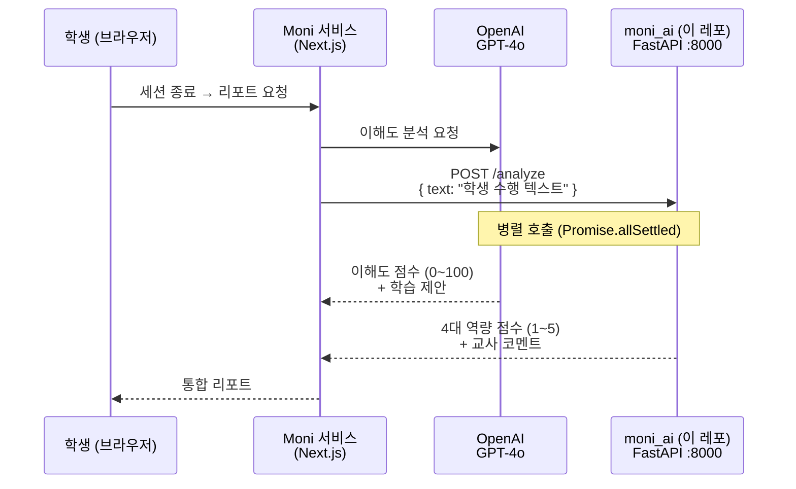

# moni_ai — 무니 역량 분석 파인튜닝 모델

> **[무니에게 알려줘(Moni)](https://github.com/GOOHAESEUNG/moni)** 서비스의 학생 역량 분석 AI 모델 레포지토리

학생이 AI 캐릭터 **무니**에게 개념을 설명하면, 이 모델이 학생의 수행 텍스트를 분석하여 **4대 핵심역량 점수(1~5)**와 **교사 관찰 코멘트**를 생성합니다.

## 메인 서비스와의 관계



Moni 서비스의 `/api/report`에서 GPT-4o와 **병렬로 호출**됩니다. GPT-4o가 이해도 점수(0~100)와 학습 제안을 생성하는 동안, 이 모델은 **4대 핵심역량**을 분석합니다.

## 모델 정보

| 항목 | 내용 |
|------|------|
| 베이스 모델 | Google Gemma 4 E4B Instruct 4bit (`mlx-community/gemma-4-e4b-it-4bit`) |
| 파인튜닝 방식 | LoRA (마지막 8개 레이어) |
| 프레임워크 | MLX (Apple Silicon 최적화) |
| 학습 데이터 | AI-Hub 142. 학생 청소년 교육활동 역량 데이터 (24,306건) |
| 학습 설정 | batch 2 x grad_accum 8 = effective batch 16, lr 2e-5, 3000 iters |
| 최종 val loss | 1.348 |

## 입출력 형식

**입력**: 학생 수행 텍스트

**출력**:
```
역량 분석:
- 자기관리역량: 4/5
- 대인관계역량: 3/5
- 시민역량: 4/5
- 문제해결역량: 3/5
교사 관찰: 학생이 모둠 활동에서 적극적으로 참여하며...
```

## 프로젝트 구조

```
├── preprocess.py           # 데이터 전처리 (CSV → JSONL)
├── finetune_config.yaml    # MLX LoRA 학습 설정
├── train.sh                # 학습 실행 스크립트
├── inference_test.py       # 추론 테스트
├── server.py               # FastAPI 추론 서버
├── CLAUDE.md               # 프로젝트 컨텍스트
└── FINETUNING_CONTEXT.md   # 파인튜닝 상세 기록
```

### Git에 포함되지 않는 파일

다음 파일들은 용량 문제로 Git에 포함되지 않으며, 직접 다운로드가 필요합니다.

| 경로 | 내용 | 용량 | 다운로드 방법 |
|------|------|------|-------------|
| `models/gemma-4-e4b-it-4bit/` | 베이스 모델 가중치 (Gemma 4 E4B 4bit 양자화) | ~3GB | `huggingface-cli download mlx-community/gemma-4-e4b-it-4bit` |
| `output/adapters/` | LoRA 파인튜닝 어댑터 가중치 | ~50MB | `train.sh`로 직접 학습하여 생성 |
| `output/train.jsonl` | 학습용 전처리 데이터 (21,875건) | ~15MB | `preprocess.py` 실행으로 생성 |
| `output/valid.jsonl` | 검증용 전처리 데이터 (2,431건) | ~2MB | `preprocess.py` 실행으로 생성 |
| `142.학생 청소년 교육활동 역량 데이터/` | AI-Hub 142번 원본 데이터셋 (CSV) | ~1.5GB | [AI-Hub](https://www.aihub.or.kr/aihubdata/data/view.do?currMenu=115&topMenu=100&aihubDataSe=data&dataSetSn=142)에서 직접 다운로드 (회원가입 필요) |

## 실행 방법

### 1. 환경 설정 (Apple Silicon 필요)

```bash
python3 -m venv .venv
source .venv/bin/activate
pip install mlx-lm fastapi uvicorn
```

### 2. 모델 다운로드

```bash
mkdir -p models
huggingface-cli download mlx-community/gemma-4-e4b-it-4bit --local-dir models/gemma-4-e4b-it-4bit
```

### 3. 데이터 전처리 및 학습

```bash
# AI-Hub에서 142번 데이터셋 다운로드 후 프로젝트 루트에 배치
python3 preprocess.py
bash train.sh
```

### 4. 추론 서버 실행

```bash
python3 server.py
# http://localhost:8000 에서 서버 시작
```

### 5. API 호출 예시

```bash
curl -X POST http://localhost:8000/analyze \
  -H "Content-Type: application/json" \
  -d '{"text": "학생이 모둠 활동에서 자신의 역할을 맡아 적극적으로 참여하였다."}'
```

## API 명세

### `POST /analyze`

학생 수행 텍스트를 분석하여 역량 점수와 교사 코멘트를 반환합니다.

**Request**
```json
{ "text": "학생 수행 텍스트" }
```

**Response**
```json
{
  "scores": {
    "자기관리역량": 4,
    "대인관계역량": 3,
    "시민역량": 4,
    "문제해결역량": 3
  },
  "comment": "교사 관찰 코멘트 (모델 생성)",
  "raw": "전체 completion 텍스트"
}
```

### `GET /health`

서버 상태 확인용 헬스체크 엔드포인트

## 환경

- Apple M3 (통합 GPU 10코어, 16GB)
- Python 3.13 + MLX
- Peak 메모리: 7.9GB

## 라이선스

Gemma 모델은 [Google Gemma Terms of Use](https://ai.google.dev/gemma/terms)를 따릅니다.
